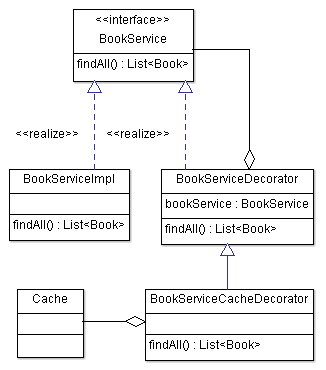

# DefensiveCache
É uma biblioteca para geração de automática de cache baseado em interfaces de serviços. Ao trabalhar com microsserviços, utilizar uma estratégia de _caching_ é bem comum para obter o máximo de performance em sua aplicação. Trechos de código como esse, é encontrado com frequência:
```csharp
        public async Task<Entity> GetObjectAsync(int id)
        {
            var value = await _distributedCache.GetAsync<Entity>("GetObjectAsync" + id);
            if(value == null)
            {
                value = await _entityRepository.GetObjectAsync(id);
                var cacheEntryOptions = new DistributedCacheEntryOptions();
                cacheEntryOptions.SetAbsoluteExpiration(TimeSpan.FromSeconds(1000));
                await _distributedCache.SetAsync("GetObjectAsync" + id, value, cacheEntryOptions);
            }
            return value;
        }
```

## Cache com _Decorator Pattern_
Uma forma elegante de desacoplar o cache da implementação concreta, é utilizando o [__Decorator pattern__](https://refactoring.guru/design-patterns/decorator), Ele permite adicionar um novo comportamento a uma implementação existente, sem precisar de herança.
Ex:



## Como Funciona
O DefensiveCache utiliza [__Reflection__](https://docs.microsoft.com/en-us/dotnet/csharp/programming-guide/concepts/reflection) para mapear a interface do serviço, a partir dessa estrutura, é realizado a compilação de uma classe concreta utilizando o  [__Roslyn__](https://github.com/dotnet/roslyn), a implementação gerada é baseado no [__Decorator pattern__](https://refactoring.guru/design-patterns/decorator), configurada por injeção de dependência via [__Scrutor__](https://github.com/khellang/Scrutor). Os métodos que não possuirem cache, serão direcionados diretamente para implementação concreta.

## Geração de Cache por Mapper
Realizando a implementação da interface _ICacheServiceMapper_, você pode configurar o método, chave e tempo padrão. Para composição da chave de cache, você pode utilizar os parâmetros do método por subistituição. Ex:

```csharp
    public class CacheServiceMapping : ICacheServiceMapper
    {
        public void Map(CacheConfiguration cacheConfiguration)
        {
            cacheConfiguration.AddCacheService<IProductRepository>(configuration =>
            {
                configuration.AddMethod(x => nameof(x.GetProduct), "prod-{id}", 60);

            });
        }
    }
```
Ao compilar o projeto, será gerado a implementação do cache por meio de __build tasks__. 
```csharp
namespace DynamicAssembly
{
    public class IProductRepositoryDynamicCache : CoreApp.DefensiveCache.Tests.Contracts.IProductRepository
    {
        private CoreApp.DefensiveCache.Tests.Contracts.IProductRepository _repository;
        private ICacheSerializer _cacheSerializer;
        private IConfiguration _cacheConfiguration;

        public IProductRepositoryDynamicCache(
            CoreApp.DefensiveCache.Tests.Contracts.IProductRepository repository, 
            IConfiguration configuration,
            ICacheSerializer cacheSerializer)
        {
            _repository = repository;
            _cacheSerializer = cacheSerializer;
            _cacheConfiguration = configuration.GetSection("Cache:Services:IProductRepository");
        }


        public CoreApp.DefensiveCache.Tests.Contracts.Product GetProduct(System.Int32 id)
        {
            var expirationGetProduct = _cacheConfiguration.GetValue("GetProduct:ExpirationSeconds", 60);
            if (expirationGetProduct == 0)
                return _repository.GetProduct(id);

            var cacheKey = $"prod-{id}";
            var cacheValue = _cacheSerializer.Get<CoreApp.DefensiveCache.Tests.Contracts.Product>(cacheKey);
            if (Equals(cacheValue, default(CoreApp.DefensiveCache.Tests.Contracts.Product)))
            {
                cacheValue = _repository.GetProduct(id);
                _cacheSerializer.Set(cacheKey, cacheValue, expirationGetProduct);
            }
            return cacheValue;
        }
    }
}
```
Adicionar configuração de cache na classe _Startup.cs_

```csharp
        public void ConfigureServices(IServiceCollection services)
        {
            services.AddDistributedMemoryCache();
            services.AddScoped<ICacheSerializer, JsonNetCacheSerializer>();
            services.DecorateWithCacheServiceMapping(new CacheServiceMapping());
        }
```


## Geração de Cache em _Runtime_
A mesma implementação de cache pode ser gerada em tempo de execução. Para realizar a configuração de cache, basta realizar o mapeamento de serviço dentro da classe _Startup.cs_
```csharp
        public void ConfigureServices(IServiceCollection services)
        {
            services.AddDistributedMemoryCache();
            services.AddScoped<ICacheSerializer, JsonNetCacheSerializer>();
            services.DecorateWithCacheDynamicService<IProductRepository>((config) =>
            {
                config.AddMethod(x => nameof(x.GetProduct), "prod-{id}", 60);
            });
        }
```

## Geração de Cache por Configuration
Caso você precise de flexibilidade, adicionar cache em uma aplicação produtiva sem precisar codificar, você pode adicionar cache por configurações. Utilizando o método de extensão _DecorateWithCacheDynamicServices_, a aplicação compila em __runtime__ todos os serviços localizados na configuração _DynamicServices_.
```json
{
  "Cache": {
    "Services": {
      "IProductRepository": {
        "GetProduct": {
          "ExpirationSeconds": 20
        }
      }
    },
    "DynamicServices": {
      "IGroupRepository": {
        "GetGroup": {
          "ExpirationSeconds": 30,
          "KeyTemplate": "group-{id}"
        }
      }
    }
  }
}
```
## Extensibilidade
No momento, a biblioteca possui suporte para dois tipos de serialização , para implementar serializadores personalizados, basta implementar a interface _ICacheSerializer_.
* BinaryNetCacheSerializer - Text/JsonSerializer
* JsonNetCacheSerializer - Binary/BinaryFormatter

## Importante
O DefensiveCache está preparado para mapear interfaces que tenham __apenas__ métodos, interfaces com qualquer propriedade __NÃO__ serão mapeadas nessa versão.

